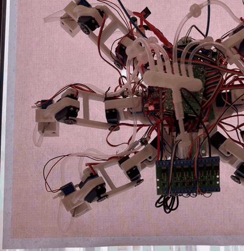

# Spider · 会爬玻璃的 DIY 六足机器人

  
   
  2026-08-20，竖直玻璃上的原地踏步实验。六只吸盘足，一次抬一条腿，安全绳在画面外。

一台 3D 打印的六足机器人：**地上能走，也能吸在竖直玻璃上爬**。18 只几十块钱的舵机、一台隔膜泵、六个十块钱的波纹吸盘，零件总共约两千元。一个 DIY 新手和 AI 结对，从第一次提交到整机上墙用了六周，到现在两个月。

它不是产品，是一张能力证明：用最便宜的零件，把"六条腿上墙"这件事做成了，还顺手发现了一个爬壁机器人的普遍现象并给出了不用传感器的解法（正在写论文）。

> **English summary.** *Spider* is a 3D-printed hexapod that walks on the floor and climbs vertical glass on six suction-cup feet (one normally-closed solenoid valve per foot, one diaphragm pump, no vacuum tank). Brain: Raspberry Pi 5; actuators: 18 × 35 kg·cm hobby servos; parts cost about ¥2,000 (~US$300). Along the way we found that **93% of a climbing step's slip happens in the instant a cup's seal breaks**, and cut three-round slip by **61%** with a sensor-free, purely kinematic "zero-force handover" (paper in preparation, see `docs/PAPER-PLAN.md`). Fully offline voice control. Built in two months by a DIY beginner pairing with an AI coding assistant. MIT licensed; walking platform derived from the open-source [MakeYourPet hexapod](https://github.com/MakeYourPet/hexapod).

## 它能做什么

| 能力 | 状态 | 说明 |
|---|---|---|
| 竖直玻璃上爬行 | ✅ 2026-08-19 起 | 六足吸盘，每足一只常闭阀，五足支撑一足摆动；不装储气罐，泵直接抽歧管，滞环维持 −60~−75 kPa |
| 停在墙上不掉 | ✅ | 常闭阀断电保持真空，泵间歇工作；掉电不等于掉落 |
| 地面行走 | ✅ | 三角 / 波浪步态，键盘遥控，可调速 |
| 全离线语音 | ✅ 2026-09-02 起 | 喊"小蜘蛛，前进三秒"就走三秒，"停下"立刻停；不联网、不要 API key；声纹锁只听主人，急停谁喊都停 |
| 少往下滑 | ✅ 量化验证 | 零力交接 + 轮转权重：三轮下滑 −61%（n=3，p≈0.001），破裂段 −88% |
| 负重、双墙面、自主上墙 | 🔜 P5 | 见 `docs/ROADMAP.md` |

## 最有意思的一段：每走一步，它都往下滑一点

爬墙跑通之后发现：机器人每换一次脚，整机就往下掉几毫米，三轮下来滑了将近 20 厘米。用手机视频逐帧追踪（NCC 模板匹配 + 阶跃基底分解，188 张核对图入库）之后，答案很干净：

- **93% 的下滑发生在同一个瞬间**：吸盘放气、密封破裂的那一下。
- **原因是腿是软的**：便宜舵机的齿轮系、打印腿、波纹吸盘，整条腿链就是一根弹簧。吸着的时候它承着重力储能，放气瞬间能量一次释放，身体就"弹"下去一格。指令机体位移只有约 42% 被实现，其余都吃进了弹性。
- **解法不用加任何传感器**：放气之前先把这条腿的"力"卸到零。做法纯运动学：给要抬的腿一个离线标定好的位移 δ，其余五条腿按轮转距离加权分摊 −δ，六条腿指令的均值不变，身体不动，腿链里的弹性势能先归还再放气。
- **结果**：三轮下滑 185 mm → 73 mm（−61%），放气破裂段 173 mm → 20 mm（−88%）。这条线正在整理成论文（默认投 RA-L），进度与数字都在 [`docs/PAPER-PLAN.md`](docs/PAPER-PLAN.md)。

想看细节：[`docs/HANDOVER-DESIGN.md`](docs/HANDOVER-DESIGN.md)（设计）、[`html/handover-ab-n3-20260826.html`](html/handover-ab-n3-20260826.html)（n=3 终版报告）、[`html/vent-snap-20260820.html`](html/vent-snap-20260820.html)（现象首次发现）。

## 硬件一览

| 部分 | 用的什么 |
|---|---|
| 步行平台 | [MakeYourPet hexapod](https://github.com/MakeYourPet/hexapod) 3D 打印机身与 coxa/femur（MIT）；小腿换成本项目自制的吸盘一体件 |
| 舵机 | 18 × DS3235 35 kg·cm 数字舵机，¥45~85/只，无任何力矩或位置回读 |
| 舵机板 | Pimoroni Servo2040，跑社区 chica 固件，Pi 经 USB 驱动 |
| 大脑 | Raspberry Pi 5，自研 Python 控制软件 |
| 吸附 | 555 双头隔膜泵 ×1、二位三通常闭电磁阀 ×6、30 mm 2.5 折波纹吸盘 ×6、每足单向阀 + 滤芯、一进六出歧管；无储气罐 |
| 传感 | 六路 XGZP6847A 吸盘压力（ADS1115 读）、母线电压/电流遥测。没有 IMU，没有力传感器，足底开关未启用 |
| 语音 | ReSpeaker Lite USB + 4Ω 3W 喇叭；sherpa-onnx 离线四件套（KWS 唤醒 → Silero VAD → SenseVoice 识别 → Matcha 合成）+ CAM++ 声纹 |
| 供电 | 2S 锂电 7.4 V 直供舵机（继电器切正极）；Pi 独立 5V/5A 降压 |
| 重量 / 成本 | 约 2.7 kg（估算，待称重）；零件约 ¥1700~2800，分两批买，见 [`docs/BOM.md`](docs/BOM.md) |

## 软件一览（`software/`）

跑在 Pi 5 上的自研 Python 包，无硬件也能仿真和测试（`--mock`），约 190 项 pytest。

| 模块 | 干什么 |
|---|---|
| `hexapod/kinematics.py` | 单腿 3 自由度正逆运动学 |
| `hexapod/gait.py` | 相位式步态引擎：三角 / 波浪 / 爬墙五足支撑 / 双足摆动 |
| `hexapod/robot.py` | 身体系足端目标 → IK → 18 路脉宽；贴墙姿态偏移 |
| `hexapod/adhesion.py` | 每足吸附状态机（压紧→抽气→吸附→放气）+ 真空回路仿真 |
| `hexapod/driver.py` | Servo2040 chica 串口协议（按固件源码逐字节核实）+ 遥测 |
| `hexapod/voice/` | 唤醒、识别、意图、合成、声纹锁 |
| `scripts/` | `sim_walk` 仿真 → `servo_center` 标定 → `walk_teleop` 键盘走 → `climb_walk` 爬墙 → `voice_teleop` / `voice_climb` 语音 |
| `logs_analysis/` | 手机视频量化管线（`ab_quant.py`）与统计脚本 |

安装、脚本顺序、上电顺序和标定流程见 [`software/README.md`](software/README.md)。

## 两个月时间线

| 日期 | 里程碑 |
|---|---|
| 2026-07-07 | 第一次提交：路线图、BOM、第一批下单 |
| 07-22 | 单腿上墙决策门通过：50 次吸放循环 >95%，挂住 1.5 kg |
| 08-08 | 整机 18 路标定完成，站立实机验证 |
| 08-17 | 每足单向阀装机，一足漏气不再连坐 |
| 08-19 | 整机首次在竖直玻璃上行走（无储气罐） |
| 08-20 | 发现"放气瞬间弹跳下滑"现象；同日实现零力交接 |
| 08-26 | n=3 拉丁方实验：三轮下滑 −61% |
| 08-31 | 论文英文初稿 v0；κ 定律判别实验上墙完成 |
| 09-02 | 语音交互换 ReSpeaker Lite USB，声纹锁上线 |

## 仓库地图

| 目录 | 内容 |
|---|---|
| [`docs/`](docs/) | 路线图、分阶段操作指南、设计论证、论文计划（下表） |
| [`software/`](software/) | Pi 5 控制软件、脚本、测试、视频量化管线 |
| [`hardware/makeyourpet-hexapod/`](hardware/makeyourpet-hexapod/) | 上游步行平台 STL/STEP、接线图（原样收录） |
| [`hardware/climbing-parts/`](hardware/climbing-parts/) | 自制吸盘小腿、门盖、气动舱固定件（[打印说明](hardware/climbing-parts/README.md)） |
| [`tools/`](tools/) | 打印件参数化生成器 |
| [`paper/`](paper/) | 论文 LaTeX 源码（中英）、图、参考文献 |
| [`html/`](html/) | 22 份实验分析与设计图解报告，直接用浏览器打开 |
| [`images/`](images/) | 零件照片、实验视频与 188 张量化核对图 |

### 文档

| 文件 | 内容 |
|---|---|
| [ROADMAP.md](docs/ROADMAP.md) | 分阶段路线图 P0~P5，每阶段验收标准与风险清单 |
| [P0-GUIDE.md](docs/P0-GUIDE.md) · [P1-GUIDE.md](docs/P1-GUIDE.md) · [P2-GUIDE.md](docs/P2-GUIDE.md) | 单腿：下单、打印、装配、真空台架、上墙决策门（含验收数据） |
| [P3-GUIDE.md](docs/P3-GUIDE.md) · [P4-GUIDE.md](docs/P4-GUIDE.md) | 整机：装配、标定、地面行走、气路上机、爬墙步态、启动死机排查 |
| [BOM.md](docs/BOM.md) | 分批采购清单，含淘宝搜索关键词与价格区间 |
| [CLIMBING-DESIGN.md](docs/CLIMBING-DESIGN.md) | 吸附方式选型（为什么不用涵道风扇）、力学预算、气路图、电气架构 |
| [HANDOVER-DESIGN.md](docs/HANDOVER-DESIGN.md) · [HANDOVER-AB-PROTOCOL.md](docs/HANDOVER-AB-PROTOCOL.md) | 零力交接的设计与实机 A/B 实验方案 |
| [DUAL-SWING-DESIGN.md](docs/DUAL-SWING-DESIGN.md) | 双足同时摆动的升级设计 |
| [P4-BAY-DESIGN.md](docs/P4-BAY-DESIGN.md) | 电气与气动舱固定件设计 |
| [VOICE-GUIDE.md](docs/VOICE-GUIDE.md) | 语音交互：硬件接法、离线模型、指令表、抗噪排障 |
| [PAPER-PLAN.md](docs/PAPER-PLAN.md) · [RELATED-WORK.md](docs/RELATED-WORK.md) | 论文总纲、核心数字、文献边界 |
| [weight-log.md](docs/weight-log.md) | 重量记录（爬墙对重量极其敏感） |

## 想自己做一台

开发顺序是按风险排的：**先花几百块用一条腿验证"能上墙"，通过决策门再买整机的舵机**。

1. 读 [`docs/ROADMAP.md`](docs/ROADMAP.md) 的 P0~P2 节。
2. 按 [`docs/BOM.md`](docs/BOM.md) 下第一批单（单腿验证套件，约 ¥600~950）。
3. 等快递时打印一条腿：coxa/femur 用上游 STL（同名多版本取编号最大的），小腿用 `hardware/climbing-parts/left-tibia-suction.stl` + 一件 `suction-foot-door.stl`，装配看上游 YouTube 频道 MakeYourPet。
4. Pi 5 烧 Raspberry Pi OS Lite 64-bit，装 `software/`，先跑 `scripts/sim_walk.py --gif walk.gif` 看步态仿真。
5. 单腿决策门（50 次吸放循环 >95%、撑住 1.5 kg）通过后，再买第二批装整机，按 P3、P4 指南走。

## 安全

- 爬墙测试全程系安全绳、地面铺垫；任何脚本退出都会断舵机电，机器人会趴下，测试时垫高机身。
- 锂电池充电不离人。

## 许可证

本仓库的自研内容（`software/` 控制软件、`docs/` 文档、`tools/` 生成脚本、自制打印件、实验数据与论文源码）以 **MIT 协议**发布，见 [LICENSE](LICENSE)。

第三方内容：

- `hardware/makeyourpet-hexapod/`：MakeYourPet hexapod 原样收录（MIT，Copyright (c) 2022 MakeYourPet.com），许可原文在该目录 `LICENSE`。
- `hardware/climbing-parts/` 中的左右 `tibia-suction*.stl` 派生自上游 `left-tibia.stl`，见 [hardware/climbing-parts/NOTICE.md](hardware/climbing-parts/NOTICE.md)。
- Servo2040 固件 chica（[EddieCarrera/chica-servo2040-simpleDriver](https://github.com/EddieCarrera/chica-servo2040-simpleDriver)，MIT）不包含在本仓库中，`software/hexapod/driver.py` 只实现其串口协议。
- "MakeYourPet" 是上游作者的名称，本项目与其无隶属或背书关系；上游作者的 YouTube 视频等不在 MIT 授权范围内。
